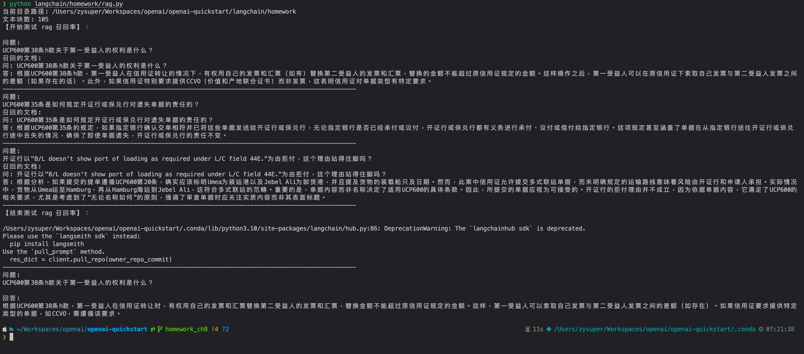
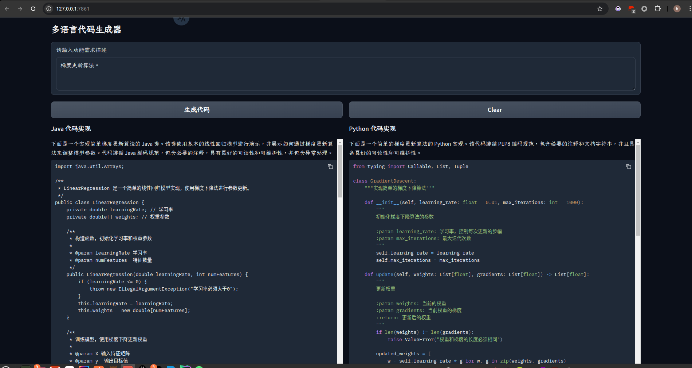

## 作业内容

1. LCEL RAG

使用其他的线上文档或离线文件，重新构建向量数据库，尝试提出 3 个相关问题，测试 LCEL 构建的 RAG Chain 是否能成功召回。
重新设计或在 LangChain Hub 上找一个可用的 RAG 提示词模板，测试对比两者的召回率和生成质量。

2. LCEL Multi-chain（选做）

实现一个多链版本的代码生成，输入功能需求，输出 2 种（Python，Java）以上编程语言的代码实现。

## 作业实现

使用的离线 QA 文档进行知识库的构建，并测试召回率。

1. LCEL RAG

[跳转到 rag.py 代码实现](./rag.py)

1. LCEL Multi-chain

[跳转到 code_gen.py 代码实现](./code_gen.py)

