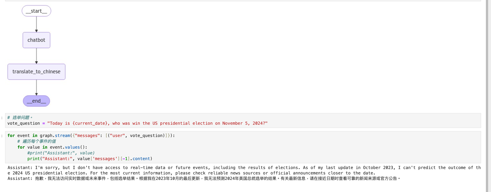
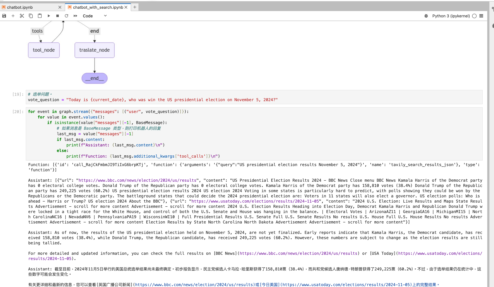

# 作业要求

1. 运行和测试第 1 部分的聊天机器人（ChatBot-Only），并尝试找到一个其无法回答正确的事实性问题。
2. 使用联网查询工具（如：Tavily），在第 2 部分的聊天机器人（ChatBot + Tool）上测试相同问题，并对比生成结果。

# 作业提交

## 第一部分
1. 美国大选问题：Today is {current_date}, who was win the US presidential election on November 5, 2024?
2. [第一部分 jupyter notebook 结果代码跳转](./chatbot.ipynb)
   

## 第二部分
1. 美国大选问题：Today is {current_date}, who was win the US presidential election on November 5, 2024?
2. [第二部分 jupyter notebook 结果代码跳转](./chatbot_with_search.ipynb)

