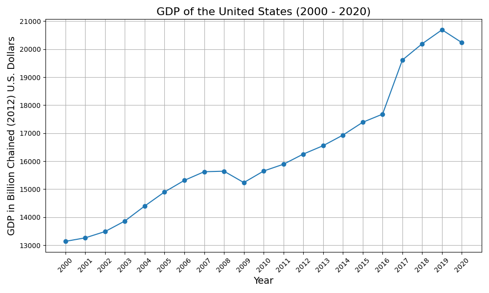

# GDP Analysis of the United States (2000 - 2020)

## 1. GDP Data

| Year | GDP in billion chained (2012) U.S. dollars |
|------|-------------------------------------------|
| 2020 | 20,234.07                                 |
| 2019 | 20,692.09                                 |
| 2018 | 20,193.9                                  |
| 2017 | 19,612.1                                  |
| 2016 | 17,680.3                                  |
| 2015 | 17,390.3                                  |
| 2014 | 16,932.1                                  |
| 2013 | 16,553.3                                  |
| 2012 | 16,254                                    |
| 2011 | 15,891.5                                  |
| 2010 | 15,649                                    |
| 2009 | 15,236.3                                  |
| 2008 | 15,643                                    |
| 2007 | 15,623.9                                  |
| 2006 | 15,315.9                                  |
| 2005 | 14,901.3                                  |
| 2004 | 14,399.7                                  |
| 2003 | 13,865.5                                  |
| 2002 | 13,488.4                                  |
| 2001 | 13,263.4                                  |
| 2000 | 13,138                                    |

## 2. Line Chart Visualization

## 3. GDP Trend Analysis
The average annual growth rate of the GDP from 2000 to 2020 is approximately **2.05%**.

### 4. Future GDP Forecast
Based on the average growth rate, the forecasted GDP for the next five years is:
- **2021:** 20,734.83 billion USD
- **2022:** 21,139.36 billion USD
- **2023:** 21,573.72 billion USD
- **2024:** 22,038.92 billion USD
- **2025:** 22,536.32 billion USD

---
**Note:** All figures are in billion chained (2012) U.S. dollars.
