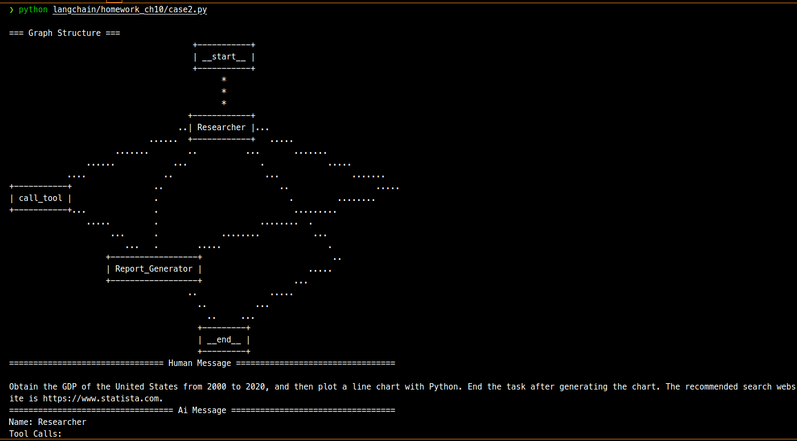

## 作业内容

1. 使用不同的大模型运行多智能体，对比结果并评选 gpt-4o 之下最好的大模型，将所有的大模型和最终结果生成一张表格；
2. 将 Chart Generator 替换为其他功能智能体（如 table_generator），为其设计提示词，然后运行查看生成结果。
3. （可选）优化研究智能体 Researcher 提示词和路由函数 route 跳转逻辑，提升图表生成的成功率。

## 作业提交

###  问题一

使用不同的大模型运行多智能体，对比结果并评选 gpt-4o 之下最好的大模型，将所有的大模型和最终结果生成一张表格；

为了提高成功率以及GDP数据的真实性，researcher 增加了一个爬虫工具，因此下面表格评价里会对是否正确使用爬虫进行评估。

具体改进细节，请参考[问题三](#问题三)。

测试模型如下，发现 gpt-4o-mini 和 deepseek-chat 的效果最好，gpt-4o-mini 的性价比最高。

- gpt-4o-mini
- deepseek-chat 
- gpt-3.5-turbo 
- qwen2.5-14b-instruct-q4_k_m （本地部署）

| 模型名称                    | 能否理解按网站搜索 | 能否正确调用爬虫工具 | 能否正确总结搜索结果 | 能否生成 python 代码 | 能否调用py代码执行 | 能否正确结束                                                 | 网络环境 | 稳定性 |
| --------------------------- | ------------------ | -------------------- | -------------------- | -------------------- | ------------------ | ------------------------------------------------------------ | -------- | ------ |
| gpt-4o-mini                 | ✅                  | ✅                    | ✅                    | ✅                    | ✅                  | ✅                                                            | 全局外网 | 9      |
| deepseek-chat               | ❌                  | ✅                    | ✅                    | ✅                    | ✅                  | -（有时候不生成 FINAL ANWER,跑第二遍）                       | 规则     | 6      |
| gpt-3.5-turbo               | ✅                  | ✅                    | ✅                    | -                    | -                  | 使用工具有时会出现幻觉，导致调用了不存在的工具而提前报错结束 | 全局外网 | 5      |
| qwen2.5-14b-instruct-q4_k_m | ❌                  | ❌                    | ❌                    | ✅                    | ✅                  | - 有时候会重复跑几遍                                         | 规则     | 3      |

- [改造后的代码 case1.py <--- 点这里](./case1.py)
- [gpt-4o-mini 运行日志 <--- 点这里](./gpt-4o-mini_result.txt)
- [deepseek-chat 运行日志 <--- 点这里](./deepseek_result_inner.txt)
- [gpt-3.5-turbo 运行日志 <--- 点这里](./gpt3.5-trubo_result.txt)
- [qwen2.5-14b-instruct-q4_k_m 运行日志 <--- 点这里](./qwen2.5_14b_result.txt)

### 问题三

（可选）优化研究智能体 Researcher 提示词和路由函数 route 跳转逻辑，提升图表生成的成功率

1. 测试发现 Researcher 调用搜索工具，返回的结果集变化较大，因此在提示词中增加了，推荐站点的描述信息: 
`The recommended search website is https://www.statista.com."`,这样  Researcher 在调用搜索工具时，会优先进行推荐站点的站内搜索。
1. Researcher 在总结检索工具的返回时，仅仅只是列出了可能有 GDP 相关数据的站点 url, 并没有直接给出数据，因此需要给 agent 一个 Scraper 爬虫工具，让他能自己调用工具来获取数据。
2. Researcher 还会出现直接生成代码的行为，因此需要调整提示词强调他的职责仅仅是搜索和总结搜索结果。`Only gather and organize information. Do not generate code or give final conclusions, leave that for other assistants.`

### 问题二

将 Chart Generator 替换为其他功能智能体（如 table_generator），为其设计提示词，然后运行查看生成结果

作业这里时将 Chart Generator 替换为 report_generator，并为其设计了提示词，然后生成带有表格和图表的美国未来 GDP 预测报告文件。

- [运行结果 GDP_Analysis_USA_2000_to_2020.md <--- 点这里](./GDP_Analysis_USA_2000_to_2020.md)
- [运行日志 case2_result.txt <--- 点这里](./case2_result.txt)
- [改造后的代码 case2.py <--- 点这里](./case2.py)